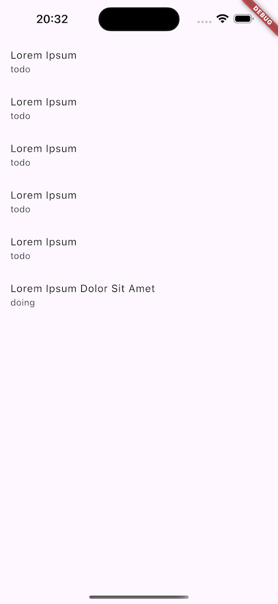

# Todolist

Exemple de client cross-platforms développé avec __Flutter__ sous forme de preuve de concept à compléter.

L'application se connecte à l'__API REST__ locale développée en __Python__ avec __FastAPI__ et une base de données __PostgreSQL__.

Démarrer le projet Docker de l'API REST avant de démarrer l'application Flutter : $ `docker compose up`

## Installation

- 🚨 A la racine du projet, créer un fichier __.env__ basé sur le fichier __.env.example__ 🚨

- depuis un client Flutter, une API web locale ne peut être atteinte à l'adresse <http://localhost>

  - pour accéder à l'API locale depuis un client __Web__, remplacer __localhost__ dans l'URL de l'API par __0.0.0.0__

  - pour accéder à l'API locale depuis un client __iOS__, remplacer __localhost__ dans l'URL de l'API par __0.0.0.0__

  - pour accéder à l'API locale depuis un client __Android__, remplacer __localhost__ dans l'URL de l'API par __10.0.0.2__

  - et dans tous les cas, ajoutez le port spécifique de l'API (ex: <http://0.0.0.0:8080>).

## Commandes utiles

- Installation des dépendances : $ `flutter pub get`

- Démarrage de l'application : $ `flutter run`

- Démarrage de l'application sur __Chrome__ : $ `flutter run -d chrome`

--

__Alexandre Leroux__  
_Enseignant / Formateur_  
_Développeur logiciel web & mobile_

Nancy (Grand Est, France)

<https://shrp.dev>
